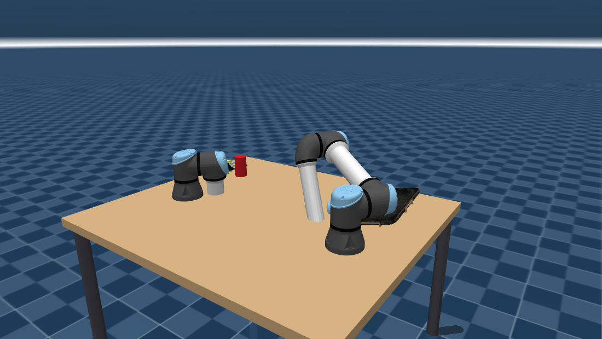

# ZERO: cross-embodiment manipulation transfer

**VLFA: Vision, Language, Force, Action.**

ZERO asks a narrow question: **if you teleoperate one robot arm, can the resulting policy drive a
completely different arm?** Not fine-tuned on the new arm, driven directly.

The bet is that it can, provided the policy never learns anything about the arm it was recorded
on. So the action and the proprioceptive state are expressed only as **end-effector poses in the
table frame**: `pos(3) + rot6d(6) + grip(1)` per hand, 20 values for two hands. No joint angles
anywhere the policy can see them. A 6-DoF arm and a 7-DoF arm produce the *same* 20 numbers for
the same physical motion, so a policy trained on one is at least well-defined on the other. This
is the same reasoning behind [Mirage](https://arxiv.org/abs/2402.19249), which shows that
Cartesian-space policies transfer zero-shot between arms where joint-space policies cannot.

The policy is **VLFA**: it reads vision (three cameras), language (the task instruction) and
**force** (fingertip load), and emits those EEF actions. Force is a first-class input, not a
diagnostic. Contact is most of what separates a grasp that will hold from one that will slip, and
it is information the cameras cannot supply. Keeping force *transferable* takes the same care as
the action space, and is described below.

Demonstrations are collected by hand on the **Seeed reBot** (source), then replayed and evaluated
on the **UR5e** (target). Both work the identical scene: the same table, the same can, the same
tray, the same physics.

### Source: Seeed reBot, 6 DoF per arm


### Target: UR5e, 6 DoF per arm, wearing the reBot's gripper



The UR5e is the target for two measured reasons. It is **6-DoF like the reBot**, where the Franka
Panda's seventh joint makes the IK non-square and adds a redundancy the source policy has no way
to resolve. And it wears the **reBot's own gripper**, grafted onto its flange, which matters more
than it sounds: the wrist camera is mounted *on the gripper*, so an identical gripper gives a
geometrically identical wrist view. The finger positions agree to **0.1 mm in the
camera frame**, and the fraction of the wrist frame occupied by the arm is 51.5% against the
reBot's 51.4%.

That property is what makes transfer possible **without re-recording a single episode**. The
alternative, a different gripper on the target, was tried on the Panda and is what the transfer
failed on: the policy reached to within 8 mm of the can zero-shot but never committed to a grasp,
because the grasp decision depends on the close-up wrist view and that was the one view where the
two robots still differed.

> **Status.** The UR5e **scene** is generated and verified (MJCF, solved home poses landing on
> `PICK_POS`/`PLACE_POS` at 0.00 mm, three cameras, grafted gripper). Its **ROS bringup is not**:
> there is no URDF, no controller YAML and no launch file yet, so it cannot be driven from
> `run_policy.sh` at the time of writing. The Panda remains the only wired-up target.

The task is **pick → hand over → place**: the left arm lifts the can, passes it to the right arm
mid-table, and the right arm sets it in the tray. It is a handover by construction, not by choice:
the base separation (0.90 m) was solved so that the can is reachable by the left arm *only* and
the tray by the right arm *only*, so an arm cannot quietly skip the handover and turn the task
into pick-and-place.

---

## What the policy sees, and what is merely stored

This distinction is the whole design, and it is easy to get wrong because LeRobot puts both in one
dataset.

**Policy-visible.** Must be embodiment-invariant:

| key | shape | meaning |
| --- | --- | --- |
| `observation.state` | 20 | per hand `pos(3) + rot6d(6) + grip(1)`, **measured** via forward kinematics |
| `action` | 20 | the same 20 values, **commanded** by the operator |
| `observation.images.front` | 224×224×3 | scene view, roughly a humanoid's viewpoint |
| `observation.images.left_wrist` | 224×224×3 | left gripper |
| `observation.images.right_wrist` | 224×224×3 | right gripper |
| `observation.force` | 14 | per hand: net 6-D wrench **in the tool frame** + normalised squeeze |
| `task` | string | the language instruction, the **L** in VLFA |

**Auxiliary.** Recorded for repair and analysis, *not* for the policy:

| key | shape | why it exists |
| --- | --- | --- |
| `observation.joint_pos` / `joint_vel` | 16 | makes the dataset **repairable**, see below |
| `observation.ft` | 24 | raw per-finger wrench, each in its own sensor frame; kept for analysis, not fed to the policy |
| `observation.ik_residual` | 6 | tracking error; lets you drop frames where the arm was not following the operator |
| `observation.grip_cmd` | 2 | latched gripper command, so "asked to close" is separable from "reached closed" |
| `observation.depth.*` | 224×224 | float32 metres, one per camera |

### Making force transferable

Force cannot be handed to the policy raw. Each fingertip sensor reports in its own frame, and those
frames differ between the arms: the reBot's finger frames sit 90° from its tool frame
while Panda's first finger is identity. The raw 24-dim vector is therefore *not the same physical
measurement* on the two robots.

`observation.force` resolves it into one shared quantity, per hand:

- **net wrench (6)**, the finger wrenches rotated into the **tool frame** and summed. External
  load: the object's weight, or the gripper pressing on something.
- **squeeze (1)**, the *mean* of the per-finger force magnitudes, divided by that robot's own
  grip-force cap (reBot 15 N, Panda 40 N), so it is dimensionless and comparable.

Both are needed, because the sum destroys the one that matters most. On a symmetric pinch the pads
push against each other and cancel: gripping the can gives 15.6 N and 14.5 N per pad, so the
**sum is ~1 N while the squeeze is ~15 N**. A first version reported only the sum and read 0.098
during a firm grasp. Measured on the fixed version: squeeze goes 0.05 open → 0.88 gripping, while
the net wrench stays flat.

Sum and mean are each defined for *any* number of fingers, so a two-finger jaw and the G1's
three-finger Dex3 present the same feature. The sensor-to-tool rotations are constant, since every
gripper joint is prismatic, so fingers translate and never rotate (verified: 0.00e+00 change
between fully open and fully closed), so they are measured once at generation time.

Joint angles, by contrast, **cannot** be made policy-visible: the reBot has 6 per arm and Panda 7,
so a policy trained on one cannot even be fed the other; the vector length differs.

But they are recorded anyway, because they make the dataset repairable. The tool-centre point of
this rig was wrong three times during development (113 mm out, then 39 mm out, then correct). Any
EEF pose recorded against a wrong TCP is permanently mislabelled *unless* the joint angles are
stored, in which case every pose can be recomputed by forward kinematics with the corrected value.
The same data is what a Mirage-style re-render of the other robot needs, since the wrist images
are embodiment-specific too.

---

## Setup

```bash
cd ~/projects25
colcon build --symlink-install --packages-select zero_description zero_bringup zero_control
source install/setup.bash
```

Requires ROS 2 Jazzy, `mujoco_ros2_control`, `mujoco`, `pinocchio`, and (for recording)
`lerobot` and `rerun-sdk`.

> **⚠️ Two Python environments, and they are not interchangeable.** ROS nodes run under system
> Python. Everything that touches a policy (training, evaluation, `policy_node`) runs under
> **`/home/sid/lerobot_env`** (lerobot 0.5.1, torch 2.12+cu128). The `~/.local` install is lerobot
> **0.4.2**: it has no SmolVLA PEFT support and a torch built for the wrong GPU arch, and a bare
> `lerobot-train` on `PATH` resolves to *that* one. The training scripts hard-code the venv binary
> so activation cannot be forgotten. Two environment facts worth knowing if you rebuild it:
> the RTX 5060 is **sm_120**, so a cu126 torch fails with *"no kernel image is available"*; and
> `nvidia-cudnn-cu12` must be **9.24.0.43**. The 9.20 wheel torch pins omits
> `libcudnn_engines_tensor_ir.so.9`, so the loader falls back to the system 9.25 and every conv
> dies with `CUDNN_STATUS_SUBLIBRARY_VERSION_MISMATCH`.

> **Where to run things.** Every `ros2` command below runs from the **workspace root**
> (`~/projects25`), since the `install/...` paths in them are relative to it. Every generator script
> runs from the **package directory** (`~/projects25/src/ZERO`), because they import
> `scripts/zero_layout.py`. Build with `colcon` from the workspace root only; there is a stray
> `build/ install/ log/` inside `src/ZERO` from an accidental build, and sourcing that one gives
> you stale descriptions.

## Recording demonstrations

Four terminals, in order. Swap `rebot` for `panda` to drive the other arm (the UR5e has a scene
but no bringup yet, see the status note above).

```bash
# 1. simulator + controllers + IK
#    can_x / can_y / can_yaw move the can; defaults are the solved pick position
ros2 launch zero_bringup rebot.launch.py
ros2 launch zero_bringup rebot.launch.py can_x:=0.30 can_y:=0.42 can_yaw:=0.5

# 2. gamepad teleoperation
ros2 launch zero_bringup rebot_teleop.launch.py

# 3. live monitor: cameras, joint plots, fingertip forces
ros2 run zero_control rerun_viewer --ros-args \
    --params-file install/zero_bringup/share/zero_bringup/config/rebot_control.yaml \
    -p depth:=true

# 4. dataset recorder
#    keep TASK in a variable: it is the language conditioning and must be byte-identical
#    across every episode AND at inference
TASK="pick up the red cylinder hand it over to the robot on the right and place it on the black tray"
ros2 run zero_control record --ros-args \
    --params-file install/zero_bringup/share/zero_bringup/config/rebot_control.yaml \
    -p root:=$HOME/zero_data/cross_v1 \
    -p task:="$TASK"
```

The recorder appends to an existing root after checking the feature schema matches, so the same
command serves every can position; only the simulator restarts between them. It compares
*schemas*, though, not camera geometry: nothing in a dataset records where the cameras were
pointing, so recording into a root captured before a camera change will silently mix
incompatible episodes. That happened here; see `scripts/merge_cross.py`.

Each episode is announced out loud, the way `lerobot_record` does: "Recording episode 3",
"Episode saved. 4 recorded", "Reset the environment", "Episode discarded. Re-record". Teleoperating
means both hands on the pad and eyes on the sim, so the terminal is the one place you are
guaranteed not to be looking. It uses lerobot's own `log_say` (`spd-say` on Linux) and is
non-blocking on purpose: a blocking utterance inside the 10 Hz recording timer would drop frames
from the episode it is announcing. Silence it with `-p play_sounds:=false`.

> **⚠️ Let the recorder finish.** LeRobotDataset only stamps the parquet footer when its writers
> are closed, so the recorder calls `finalize()` on the way out. Kill it before that completes and
> you get a directory that looks perfect (right `meta/info.json`, right episode and frame counts,
> a multi-megabyte data file) that pyarrow refuses to open with *"Parquet magic bytes not found in
> footer"*. The frames are gone. A 2-episode take was lost that way while this was being built.
> **"Dataset saved" is the signal that it is safe to exit**, not "Stop recording", which is spoken
> before the close.

Only one simulator may run at a time. Launching a second gives you two `controller_manager`s on
one ROS graph, both answering each other's service calls, and every controller spawner fails with
a misleading message, so `rebot.launch.py` refuses to start if one is already up.

### Moving the can

`can_x`, `can_y` and `can_yaw` are launch arguments on the sim, in table-frame metres/radians.
Defaults come from the solved pick position, so a bare launch is unchanged.

The can's pose lives in the MJCF's `home` keyframe, so the launch reads that keyframe, substitutes
the can's free-joint block, and writes a `<key .../>` file that
mujoco_ros2_control's `override_start_position_file` hardware parameter picks up. Everything else
(arm poses, gripper, tray) is copied verbatim, so only the can moves. Off-table values are
rejected at launch rather than spawning the can somewhere unrecordable.

There is no `can_z`: the resting height is a function of the can's own geometry, and hand-setting
it invites a can that floats or is half-buried.

**This is per-launch, not per-episode.** Randomising the can between episodes of one session needs
the pose changed at runtime, which the installed mujoco_ros2_control cannot do: it exposes only
`reset_world`, `set_pause` and `step_simulation`. Upstream has a `SetFreeJointState` service that
would do it; this build predates it. Until then, per-position batches mean restarting the sim.

### Resuming a dataset

Point the recorder at an existing `root` and it **appends**. It reports
`RESUMING dataset ...: N episodes already recorded`, says "Resuming, N episodes on disk", and
numbers the next episode N. So a 30-episode session can be split across restarts, breaks, or a
crash.

`LeRobotDataset.create` raises `FileExistsError` on an existing root, so the recorder loads instead
of creating when it finds one.

**A directory with `meta/info.json` is not necessarily a usable dataset.** That file is written up
front; `meta/episodes/*.parquet`, the episode index, is only written when the writers close. A
killed recorder therefore leaves `info.json` claiming N episodes with no index. Handing that to
LeRobotDataset does not fail locally: it reads the missing index as "not downloaded yet" and goes
to the Hugging Face Hub, which 404s for a dataset that exists only on disk, and the traceback then
points at huggingface_hub instead of at the half-written directory. The recorder checks for the
index first and says so in one sentence, including how to check whether the frame data survived.

To open a finished dataset for training:

```python
from lerobot.datasets.lerobot_dataset import LeRobotDataset
ds = LeRobotDataset(repo_id="zero/cross", root="~/zero_data/cross_v2")
```

Before appending, the recorder compares the dataset's feature set against what it would write and
refuses if they differ, because the schema here has changed repeatedly (force promoted into the
observation, depth added, joint velocities added), and mixing two schemas in one directory
produces a dataset that is quietly two incompatible halves.

### Gamepad

| control | action |
| --- | --- |
| **LB** / **RB** | hold to drive the left / right arm; nothing held, nothing moves |
| left stick | X / Y in the table plane |
| right stick | Z (up/down) and yaw |
| **Y** | toggle the selected gripper. *Latches*, so it stays closed while you carry |
| **A** | return both arms home |
| **START** | resync the target to the measured pose |
| **X** | start / stop recording an episode |
| **B** | discard the episode in progress. The index is reused, so nothing is skipped |

Or from the keyboard, using `lerobot_record`'s own bindings so muscle memory carries over:
**SPACE** start · **RIGHT** end and save · **LEFT** discard and re-record · **ESC** stop and exit.
`-p keyboard:=false` disables them.

The dead-man doubles as the arm selector deliberately: the teleop node integrates stick velocity
into an absolute pose, and an integrator with no dead-man accumulates stick noise while you are
looking at the screen. It also makes "which arm am I driving" unambiguous.

Verify the axis map on a fresh gamepad with `ros2 run zero_control joy_probe`, which names each
control as you move it. Clones keep the XInput button indices but not always the axis *signs*;
flip `sign_x/y/z/yaw` in `zero_bringup/config/teleop.yaml`.

---

## Choosing where to put the can

```bash
MUJOCO_GL=egl python3 scripts/plan_can_poses.py 10 3     # 10 positions, >=3 usable approaches
```

Positions are not picked by eye. A position is valid only if the **left** arm can reach it
(IK-verified against the grasp orientations the operator actually used, not FK sampling, which
under-reports), the **right** arm *cannot* (otherwise the handover is unmotivated and the demos
carry contradictory evidence about which arm picks), a **G1** arm can reach it, and the can fits on
the table. Of the ~100 cells that qualify, the script farthest-point-samples N so they spread over
the reachable region instead of clustering where the IK is comfortable.

## Training

```bash
# 1. build the training views (drops depth, symlinks videos -- no re-encoding)
python3 scripts/make_train_view.py ~/zero_data/cross_v2 crossv2

# 2. fine-tune SmolVLA
bash scripts/train_base_full.sh 30000 crossv2_full_c25 $HOME/zero_data/crossv2_base
```

The **view** exists because the recorded dataset carries three 224×224 float32 depth maps per
frame, 600 kB/frame or 14.7 GiB of parquet against 367 MiB of video, that the policy never
reads. Rewriting just the vector columns takes it to **4.8 MiB** and drops `data_s` to ~0.005 s.
Two views are built: `*_base` (state + 3 cameras) and `*_vlfa` (adds the 14-dim force vector).
lerobot types every `observation.*` key as a policy input, so **the view is the input contract**:
the difference between the two runs is exactly the force ablation.

`train_base_full.sh` trains the **action expert only** (100M of 450M; the VLM and vision tower stay
frozen). That is SmolVLA's own default recipe, and it is also the only thing that fits: 403M
trainable OOMs on 8 GB, because AdamW needs ~16 bytes per trainable parameter. LoRA was tried and
is kept as `train_base_lora.sh` for the ablation: at 2.9M trainable it reached 39.5 mm and never
grasped. **More data, not more capacity, was the lever.**

## Running a policy

```bash
pkill -f 'zero_control/teleop'        # see the warning below
ros2 launch zero_bringup rebot.launch.py can_x:=0.48 can_y:=0.52
TRACE=$HOME/rollout.npz bash scripts/run_policy.sh    # X on the gamepad starts/stops
```

`run_policy.sh` starts its own `joy_node` (X comes from `/joy`, which the `joy` driver publishes,
*not* the teleop node) and reads the task string from the dataset metadata rather than a hardcoded
default, so training and inference cannot disagree about the instruction.

> **⚠️ Never leave `zero_control/teleop` running alongside a policy.** It publishes the same
> `/zero/eef_target` topic at 50 Hz against the policy's 10 Hz and holds the home pose when idle,
> so it silently overrides every policy command. Measured: the policy asked for 162 mm of motion
> and the arm moved **2.3 mm** in 106 s, while `resid` read 1 mm because the arm was tracking
> *teleop's* target perfectly. `policy_node` now refuses to start if another publisher is present.
> Note `rebot_teleop.launch.py` starts both `joy_node` *and* teleop, so use it for recording only.

Evaluating and debugging:

```bash
/home/sid/lerobot_env/bin/python scripts/eval_chunk_error.py [CHECKPOINT]   # error in mm, not loss
bash scripts/diag_live_obs.sh                                              # dump one live observation
```

`eval_chunk_error.py` exists because the training loss is an MSE on normalised, zero-padded
32-dim vectors, which cannot be compared against anything physical. This unnormalises the predicted
chunk and reports millimetres, against the number that actually matters: the reBot jaw opens to
100 mm on a 66 mm can, so there is only **17 mm of lateral clearance** at the grasp.

`diag_live_obs.sh` captures one live observation and diffs it against the dataset. A policy that
tracks demos offline but not in rollout is almost always being fed a different observation, and
guessing at that costs hours.

## Results

| run | data | trainable | chunk error (L/R) | rollout |
| --- | --- | --- | --- | --- |
| LoRA r=32 | 51 eps | 2.9M | 39.5 / 32.0 mm | never grasps |
| expert-only | 51 eps | 100M | 16.6 / 12.7 mm | misses by 57 mm |
| **expert-only** | **82 eps** | **100M** | **11.6 / 5.7 mm** | **completes the task** |

The third row executes the whole thing autonomously in ~52 s: approach → grasp (closest approach
**3.3 mm**) → lift → carry to the handover → the second arm meets it → both jaws closed 78 mm
apart → left releases → right carries to the tray → releases → both home.

Zero-shot on the Panda the same checkpoint reaches **8.0 mm** from the can, inside the jaw
clearance, on an arm it has never seen, with 7 DoF instead of 6. But the gripper command crosses
its threshold 15 times instead of 2 and never commits, so the handover never fires. **The spatial
policy transfers; the grasp decision does not**, and that decision is the one that depends on the
close-up wrist view, which is the one place the two robots still look different.

---

## Regenerating the robot descriptions

Every description is generated from one file, `scripts/zero_layout.py`. Nothing is hand-edited,
the MJCF, the URDF, the controller YAML and the launch files all come from that single registry,
so the two descriptions cannot drift apart.

```bash
python3 scripts/gen_scene.py   rebot   # MJCF: arms, table, can, tray, cameras, sensors
python3 scripts/gen_urdf.py    rebot   # URDF + <ros2_control> block
python3 scripts/gen_bringup.py rebot   # controller YAML + launch files
python3 scripts/check_parity.py rebot  # assert everything still agrees
```

**Run `check_parity.py` after any change.** `mujoco_ros2_control` binds joints, cameras and
sensors across the two descriptions **by name**, and a mismatch does not raise: the parts that
match keep working, so the symptom is "the gripper does nothing" or "no images", which reads as a
tuning or networking fault. The check asserts joint names, actuator transmissions, camera names,
force/torque sensor pairs, URDF-vs-MJCF forward kinematics (0.003 mm), and that the IK's tool
point coincides with where the fingers actually close (0.05 mm).

Supporting tools:

| script | purpose |
| --- | --- |
| `measure_tcp.py` | measure where the pads meet; prints the `eef_offset` to paste into the registry |
| `reach_gate.py` | GO/NO-GO: what volume is reachable by both reBots *and* both G1 arms |
| `plan_can_poses.py` | pick N valid, well-spread can positions (see above) |
| `hero_shot.py` | render the images in this README |
| `make_shared_gripper.py` | extract the reBot gripper as a standalone MJCF, for grafting onto another arm |

Data and policy tools (run these with `/home/sid/lerobot_env/bin/python`):

| script | purpose |
| --- | --- |
| `make_train_view.py` | strip depth/auxiliary columns into a training view; symlinks videos |
| `merge_cross.py` | merge good episodes across datasets, excluding pre-camera-fix ones |
| `train_base_full.sh` | SmolVLA fine-tune, expert-only. The working recipe |
| `train_base_lora.sh` | the LoRA ablation, kept for the comparison |
| `run_policy.sh` | drive the sim from a checkpoint; `ROBOT=panda` for the other arm |
| `eval_chunk_error.py` | open-loop chunk error in millimetres and degrees |
| `diag_live_obs.sh` | capture one live observation and diff it against the dataset |
| `recover_dataset.py` | rebuild a dataset whose episode index was lost |
| `drop_episodes.py` | rebuild a dataset without some episodes (re-encodes video) |

---

## Known constraints

Things that are measured, not guessed, and that will bite if you forget them.

- **10 Hz, not 30.** The camera rate is capped by MuJoCo's offscreen rendering: three cameras at
  224×224 gives 10.17 Hz, five gave 5.00. Resolution is nearly free; each additional camera is
  not. `top` and `side` are commented out in `SCENE_CAMS` and cost frame rate to restore.
- **The reBot is at its workspace limit.** It cannot achieve a top-down approach at the can's
  position, so grasps there are diagonal. This was expected to hurt and did not: the trained
  policy grasps at 3.3 mm closest approach. The base separation was solved against an older,
  incorrect tool point and is still worth re-solving.
- **Grasp the can in its upper half.** Both arms hold it when grasped 40–70 % up its height.
- **Depth reads out to ~88 m** (the skybox). Clip it before training.
- **~170 MB per minute** of recording, mostly depth. Fifty 30-second demos is roughly 1.4 GB.
- **Object poses are not recorded**, so success cannot be auto-labelled; episodes need
  annotating, or add the poses and re-record. The can's position can be *reconstructed* from the
  left fingertip force onset plus `observation.state`, which is how the position clusters above
  were recovered.
- **There is no validation split.** Every error number here is measured on training episodes, so
  it reports fit, not generalisation, and structurally cannot detect overfitting. Hold out one
  episode per position on the next recording pass.
- **The teleop leash bounds the recorded `action`↔`state` gap.** At `leash: 0.03` / `leash_rot:
  0.20`, 28 % of frames sat more than 15 mm from their commanded pose and rotation peaked at
  11.5°. Now `0.015` / `0.05`, giving 4.8 % and 2.9°. This matters beyond precision: Mirage
  requires the achieved pose within 0.015 m at every timestep, and that is exactly the condition
  that lets `action` serve as "the next pose to achieve" **without** fitting a forward dynamics
  model `f(p,a) → p'`. Absolute actions alone do not buy that; absolute actions *plus* a settled
  controller do.
- **`observation.state`'s grip channels are the last COMMANDED grip, not a sensor.** Anything
  publishing that observation must reproduce it. Defaulting them to 0.0 (*closed*) before the first
  command put the policy in a state absent from all 40k training frames and cut its predicted
  motion by 4–16×.
- **The IK residual on `/zero/ik_status` is a single-step DLS error, not a distance to target.**
  A 70–86 mm move needs ~20 ticks to settle and gets 10 at 10 Hz, so mid-motion values of 20–80 mm
  are normal and do not indicate a problem.
- **A 404 from huggingface_hub when opening a local dataset** means the local metadata is
  incomplete, not that you need credentials. The Hub is only consulted when `load_metadata()`
  fails, usually a missing `meta/episodes/` index from a killed recorder.
- **Post-compile MuJoCo edits are silently ignored.** Writing `body_gravcomp`, `geom_friction` or
  `actuator_forcerange` on an already-compiled model measures byte-identical to not doing it.
  Everything must be set on the `MjSpec` at generation time.

---

## Where this is going

**The source policy works.** A SmolVLA fine-tune on 82 teleoperated episodes drives the reBot
through the whole bimanual pick → handover → place autonomously. That was the prerequisite for
everything below, and it is done.

The reBot → UR5e transfer is the *experiment*, not the destination. Two fixed-base arms on a
table are the cleanest possible test of the claim: identical task, identical scene, identical
action space, and nothing different except the arm. The control half of that claim already holds:
the same 20-dim absolute EEF pose goes into each robot's own IK, `T^S_T` from Mirage is the
identity because all the robots share the table frame, and even the *visually mismatched* Panda
reached to within 8 mm of the can having never seen one.

What does not transfer yet is the **grasp decision**, and the reason is visual: the wrist camera is
the view the decision depends on, and it is the one view where the two robots differ. Three routes,
in increasing cost:

1. **A visually matched target arm, chosen and built.** The UR5e wearing the
   reBot's own gripper, so the wrist view is geometrically identical and no re-recording is
   needed. Remaining: URDF, controller YAML and launch files. The UR5e ships MJCF only, so
   `gen_urdf.py` needs either a converter or an MJCF-derived path.
2. **Cross-painting the `front` view**, Mirage's own method. Its same-base-pose assumption holds
   for two table-mounted arms; it was demoted for the G1, not for this leg.
3. **A wrist-only policy**, dropping `front` entirely, the one view that can never match.

Still unrun, and both cheap: **VLFA** (`crossv2_vlfa` is built and waiting; force becomes a policy
input with no model surgery, and `crossv2_base` is its control) and the **action-prior** two-stage
scheme from `research/2606.26095-action-priors.md`, whose Stage 1 needs actions only.


The destination is the **Unitree G1**: a humanoid, doing the same bimanual pick-and-handover with
its own arms and three-finger Dex3 hands. A humanoid changes what "the same action space" means: the base can
move, the cameras move with the head, and the workspace is defined by the whole body rather than a
bolted-down shoulder. Getting reBot → UR5e to work first means that when the G1 arrives, the only
new variable is the embodiment. The action representation, the recording pipeline, the dataset
schema and the evaluation are all already settled and already known to transfer once.

If a policy recorded on a 6-DoF hobby arm can drive a Panda without ever seeing one, the same
argument should carry to a humanoid. That is the thing worth finding out.
